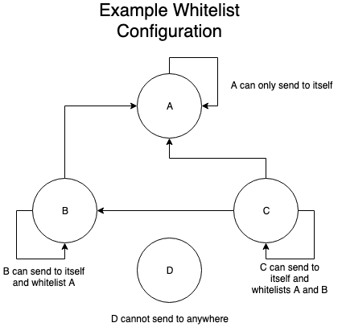

# ARCA Token
ERC20 Token with 1404 Restrictions

## Use Case
The ARCA token is an ERC20 compatible token with transfer restrictions added that follow the ERC1404 standard. The 1404 Restrictions will use whitelists to segregate groups of accounts so they are only allowed to transfer to designated destination addresses.

## Token
The following features will be determined at deploy time, locking them in place.

 - Name
 - Symbol
 - Decimals

The following feature can be increased via minting after deployment.

 - Total Supply

On deployment, all tokens will be transferred to the owner account passed in during deployment.

There will be **NO** functionality for burning tokens after the initial creation of the contract, but minting is supported.

## Users
All accounts need to be one of 2 roles; Owner, Admin or have a whitelist other than 0, in order to be able to interact with the contract

 - Owner: Owners can add/remove other owners or admins, mint tokens, and transfer to any other valid account
 - Admins: Admins can revoke tokens, update user whitelists, and update whitelist configurations, and transfer to any other valid account
 - Whitelist: Whitelist users can transfer tokens to other valid accounts subject to whitelist restrictions.

## Owners

Owner accounts can add and remove other account addresses to both the list of Owners and Admins. Owners cannot remove themselves from being an Owner.  Accounts in the Owner list can also mint new tokens to other addresses and upgrade the contract logic including transfer restrictions.

The Owner account specified at the time of deployment will be the only Owner account by default.

## Administrators

Admins can add or remove accounts from any of the whitelists. They can also enable or disable transfers between whitelists.

## Whitelists
Before tokens can be transferred to a new address, it must be validated that the source is allowed to send to that destination address and that the destination address can receive funds. If the sending client does not check this in advance and sends an invalid transfer, the transfer functionality will fail and the transaction will revert.

Owner and Admin accounts will have the ability to transfer tokens to any valid address, regardless of the whitelist configuration state.

An address can only be a member of one whitelist at any point in time. If an admin adds any address to a new whitelist, it will no longer be a member of the previous whitelist it was on (if any). Adding an address to a whitelist of ID 0 will remove it from all whitelists, as whitelist ID 0 is invalid. Removing an address from the existing whitelist will set it to belong to whitelist 0. An address with whitelist 0 will be prevented from transferring or receiving tokens. Any tokens on a whitelist 0 account are frozen. All addresses belong to whitelist 0 by default.

Any whitelist can be configured to have multiple Outbound Whitelists. When a transfer is initiated, the restriction logic will first determine the whitelist that both the source and destination belong to. Then it will determine if the source whitelist is configured to allow transactions to the destination whitelist. If either address is on whitelist 0 the transfer will be restricted. Also, the transfer will be restricted if the source whitelist is not configured to send to the destination whitelist.

Example
- Whitelist A is only allowed to send to itself.
- Whitelist B is allowed to send to itself and whitelist A.
- Whitelist C is allowed to send to itself and whitelists A and B.
- Whitelist D is not allowed to transfer to any whitelist, including itself.

<p align="center" style="padding-top: 10px; padding-bottom: 5px;">
  
</p>


A total of 255 whitelists can be utilized, each with the ability to restrict transfers to all other whitelists.

By default, all whitelists will **NOT** be allowed to transfer between source and destination addresses within the same whitelist. This must explicitly be enabled. By default all whitelists block all transfers.

Administrators will have the ability modify a whitelist beyond the default configuration to add or remove outbound whitelists.

## Restrictions

If a transfer is restricted, the code will follow the ERC1404 spec and revert the transaction. Any wallets interacting with an ERC1404 token contract should first query the contract to determine if the transfer is allowed, and if not, show the appropriate error to the user (including the reason code/text from the contract).

## Pausing

The owner may pause/unpause the contract. When the contract is paused all transfers will be blocked. When deployed the contract is initially unpaused.

## Minting
Owner accounts can mint tokens to Owner, Admin, or any whitelisted account. Minting tokens increases the total supply of tokens and the balance of the account the tokens are minted to.

## Revoking
Admin accounts can revoke tokens from any account. Revoking tokens has no effect on the total supply, it increases the balance of the admin revoking the tokens and decreases the balance of the account the tokens are revoked from.

## Upgrading

The contract is upgradeable and allows for Owners to update the contract logic while maintaining contract state. Contracts can be upgraded to have more or less restrictive transfer logic or new transfer paradigms including escrow. Upgrading can be a **potentially destructive** operation if the new contract is incompatible with the existing contract due to broken upgrade methods or memory layout issues.

To update the contract logic:\
>**1:** Deploy the new contract to the ethereum mainnet, this contract must impliment the Proxiable contract as defined https://github.com/ethereum/EIPs/blob/master/EIPS/eip-1822.md

>**2:** An Owner  must then call the updateCodeAddress method on the existing token contract with the address of the contract deployed in step 1

  The Proxiable contract checks that the new logic contract implements the proxiableUUID method and returns the proper hash but care must still be taken to ensure the new contract implements correct update logic and compatible memory layout. https://blog.trailofbits.com/2018/09/05/contract-upgrade-anti-patterns/

# Testing
You should be able to install dependencies and then run tests:
```
$ npm install
$ npm run test
```

For unit test code coverage metrics:
```
$ npm run coverage
```